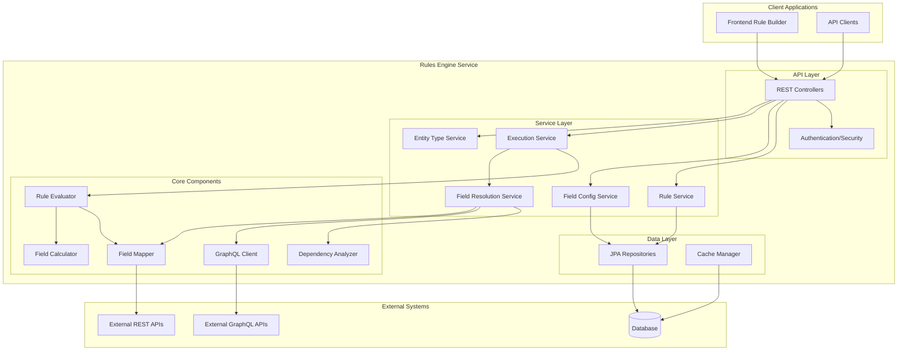

# Design Document: Rules Engine

## Overview

The Rules Engine is a Spring Boot Java web service that provides comprehensive rule management, execution, and field configuration capabilities. It serves as the backend for rule-based applications, offering RESTful APIs for rule CRUD operations, dynamic field value resolution from external data services, and sophisticated rule execution with dependency analysis.

The system is designed around three core concepts:
1. **Rule Management**: Creating, organizing, and maintaining business rules with folder-based organization
2. **Field Configuration**: Defining available fields, their data sources, and mapping configurations including calculated fields
3. **Rule Execution**: Evaluating rules against data contexts with dynamic field resolution and entity filtering

## Architecture

### High-Level Architecture



### Design Rationale

**Spring Boot Framework**: Chosen for its mature ecosystem, built-in security, and excellent REST API support. Provides dependency injection, auto-configuration, and production-ready features out of the box.

**JPA/Hibernate**: Selected for database abstraction and ORM capabilities, enabling complex queries while maintaining database independence.

**Reflection-Based Mapping**: Allows flexible field extraction from complex nested JSON responses without requiring predefined DTOs for every external service.

**Dependency Graph Analysis**: Ensures calculated fields are resolved in the correct order and prevents circular dependencies, critical for complex business logic.

## Components and Interfaces

### REST API Controllers

#### RuleController
```java
@RestController
@RequestMapping("/api/rules")
public class RuleController {
    @PostMapping
    ResponseEntity<RuleResponse> createRule(@RequestBody CreateRuleRequest request);
    
    @GetMapping
    ResponseEntity<PagedRuleResponse> getRules(@RequestParam(required = false) String filter,
                                               @RequestParam(defaultValue = "0") int page,
                                               @RequestParam(defaultValue = "20") int size);
    
    @GetMapping("/{id}")
    ResponseEntity<RuleResponse> getRule(@PathVariable Long id);
    
    @PutMapping("/{id}")
    ResponseEntity<RuleResponse> updateRule(@PathVariable Long id, @RequestBody UpdateRuleRequest request);
    
    @DeleteMapping("/{id}")
    ResponseEntity<Void> deleteRule(@PathVariable Long id);
    
    @PostMapping("/{id}/execute")
    ResponseEntity<RuleExecutionResult> executeRule(@PathVariable Long id, @RequestBody ExecutionContext context);
    
    @PostMapping("/execute-batch")
    ResponseEntity<List<RuleExecutionResult>> executeBatch(@RequestBody BatchExecutionRequest request);
    
    @PostMapping("/validate")
    ResponseEntity<RuleValidationResult> validateRule(@RequestBody RuleDefinition rule);
    
    @GetMapping("/{id}/versions")
    ResponseEntity<List<RuleVersionResponse>> getRuleVersions(@PathVariable Long id);
    
    @GetMapping("/{id}/versions/{version}")
    ResponseEntity<RuleResponse> getRuleVersion(@PathVariable Long id, @PathVariable Integer version);
    
    @PostMapping("/{id}/revert/{version}")
    ResponseEntity<RuleResponse> revertToVersion(@PathVariable Long id, @PathVariable Integer version);
    
    @PostMapping("/{id}/test")
    ResponseEntity<RuleTestResult> testRule(@PathVariable Long id, @RequestBody RuleTestRequest request);
    
    @PostMapping("/test-batch")
    ResponseEntity<List<RuleTestResult>> testRules(@RequestBody BatchRuleTestRequest request);
}
```

#### FolderController
```java
@RestController
@RequestMapping("/api/folders")
public class FolderController {
    @PostMapping
    ResponseEntity<FolderResponse> createFolder(@RequestBody CreateFolderRequest request);
    
    @GetMapping
    ResponseEntity<List<FolderResponse>> getFolders();
    
    @PutMapping("/{id}")
    ResponseEntity<FolderResponse> updateFolder(@PathVariable Long id, @RequestBody UpdateFolderRequest request);
    
    @DeleteMapping("/{id}")
    ResponseEntity<Void> deleteFolder(@PathVariable Long id, @RequestParam(defaultValue = "MOVE_TO_PARENT") String strategy);
}
```

#### FieldConfigController
```java
@RestController
@RequestMapping("/api/field-configs")
public class FieldConfigController {
    @PostMapping
    ResponseEntity<FieldConfigResponse> createFieldConfig(@RequestBody CreateFieldConfigRequest request);
    
    @GetMapping
    ResponseEntity<List<FieldConfigResponse>> getFieldConfigs();
    
    @GetMapping("/for-builder")
    ResponseEntity<List<BuilderFieldConfigResponse>> getFieldConfigsForBuilder();
    
    @PutMapping("/{id}")
    ResponseEntity<FieldConfigResponse> updateFieldConfig(@PathVariable Long id, @RequestBody UpdateFieldConfigRequest request);
    
    @DeleteMapping("/{id}")
    ResponseEntity<Void> deleteFieldConfig(@PathVariable Long id);
}
```

#### FieldValuesController
```java
@RestController
@RequestMapping("/api/field-values")
public class FieldValuesController {
    @PostMapping("/search")
    ResponseEntity<PagedFieldValueResponse> searchFieldValues(@RequestBody FieldValueSearchRequest request);
    
    @GetMapping("/{fieldName}")
    ResponseEntity<List<FieldValueResponse>> getFieldValues(@PathVariable String fieldName,
                                                           @RequestParam(defaultValue = "0") int page,
                                                           @RequestParam(defaultValue = "20") int size);
}
```

#### RuleTemplateController
```java
@RestController
@RequestMapping("/api/rule-templates")
public class RuleTemplateController {
    @PostMapping
    ResponseEntity<RuleTemplateResponse> createTemplate(@RequestBody CreateRuleTemplateRequest request);
    
    @GetMapping
    ResponseEntity<List<RuleTemplateResponse>> getTemplates(@RequestParam(required = false) String category,
                                                           @RequestParam(required = false) List<String> tags);
    
    @PutMapping("/{id}")
    ResponseEntity<RuleTemplateResponse> updateTemplate(@PathVariable Long id, @RequestBody UpdateRuleTemplateRequest request);
    
    @DeleteMapping("/{id}")
    ResponseEntity<Void> deleteTemplate(@PathVariable Long id);
    
    @PostMapping("/{id}/instantiate")
    ResponseEntity<RuleResponse> instantiateTemplate(@PathVariable Long id, @RequestBody TemplateInstantiationRequest request);
}
```

#### RuleScheduleController
```java
@RestController
@RequestMapping("/api/rule-schedules")
public class RuleScheduleController {
    @PostMapping
    ResponseEntity<RuleScheduleResponse> createSchedule(@RequestBody CreateRuleScheduleRequest request);
    
    @GetMapping
    ResponseEntity<List<RuleScheduleResponse>> getSchedules();
    
    @PutMapping("/{id}")
    ResponseEntity<RuleScheduleResponse> updateSchedule(@PathVariable Long id, @RequestBody UpdateRuleScheduleRequest request);
    
    @DeleteMapping("/{id}")
    ResponseEntity<Void> deleteSchedule(@PathVariable Long id);
    
    @GetMapping("/{id}/executions")
    ResponseEntity<List<ScheduledExecutionResponse>> getExecutionHistory(@PathVariable Long id);
}
```

#### AnalyticsController
```java
@RestController
@RequestMapping("/api/analytics")
public class AnalyticsController {
    @GetMapping("/rule-usage")
    ResponseEntity<RuleUsageAnalytics> getRuleUsageAnalytics(@RequestParam LocalDate startDate,
                                                            @RequestParam LocalDate endDate,
                                                            @RequestParam(required = false) List<Long> ruleIds);
    
    @GetMapping("/field-usage")
    ResponseEntity<FieldUsageAnalytics> getFieldUsageAnalytics(@RequestParam LocalDate startDate,
                                                              @RequestParam LocalDate endDate);
    
    @GetMapping("/performance")
    ResponseEntity<PerformanceAnalytics> getPerformanceAnalytics(@RequestParam LocalDate startDate,
                                                                @RequestParam LocalDate endDate);
    
    @PostMapping("/export")
    ResponseEntity<byte[]> exportAnalytics(@RequestBody AnalyticsExportRequest request);
}
```

#### RuleChangeController
```java
@RestController
@RequestMapping("/api/rule-changes")
public class RuleChangeController {
    @PostMapping
    ResponseEntity<RuleChangeResponse> submitRuleChange(@RequestBody SubmitRuleChangeRequest request);
    
    @GetMapping
    ResponseEntity<List<RuleChangeResponse>> getRuleChanges(@RequestParam(required = false) String status,
                                                           @RequestParam(required = false) String assignee);
    
    @PostMapping("/{id}/approve")
    ResponseEntity<RuleChangeResponse> approveRuleChange(@PathVariable Long id, @RequestBody ApprovalRequest request);
    
    @PostMapping("/{id}/reject")
    ResponseEntity<RuleChangeResponse> rejectRuleChange(@PathVariable Long id, @RequestBody RejectionRequest request);
    
    @PostMapping("/{id}/comments")
    ResponseEntity<CommentResponse> addComment(@PathVariable Long id, @RequestBody AddCommentRequest request);
}
```

#### EntityController
```java
@RestController
@RequestMapping("/api/entities")
public class EntityController {
    @PostMapping("/filter")
    ResponseEntity<EntityFilterResult> filterEntities(@RequestBody EntityFilterRequest request);
}
```

#### EntityTypeController
```java
@RestController
@RequestMapping("/api/entity-types")
public class EntityTypeController {
    @PostMapping
    ResponseEntity<EntityTypeResponse> createEntityType(@RequestBody CreateEntityTypeRequest request);
    
    @GetMapping
    ResponseEntity<List<EntityTypeResponse>> getEntityTypes();
    
    @PutMapping("/{id}")
    ResponseEntity<EntityTypeResponse> updateEntityType(@PathVariable Long id, @RequestBody UpdateEntityTypeRequest request);
    
    @DeleteMapping("/{id}")
    ResponseEntity<Void> deleteEntityType(@PathVariable Long id);
}
```

#### TenantController
```java
@RestController
@RequestMapping("/api/tenants")
public class TenantController {
    @PostMapping
    ResponseEntity<TenantResponse> createTenant(@RequestBody CreateTenantRequest request);
    
    @GetMapping
    ResponseEntity<List<TenantResponse>> getTenants();
    
    @PutMapping("/{id}")
    ResponseEntity<TenantResponse> updateTenant(@PathVariable Long id, @RequestBody UpdateTenantRequest request);
    
    @GetMapping("/{id}/usage")
    ResponseEntity<TenantUsageResponse> getTenantUsage(@PathVariable Long id);
    
    @PostMapping("/{id}/backup")
    ResponseEntity<TenantBackupResponse> createTenantBackup(@PathVariable Long id);
}
```

#### IntegrationController
```java
@RestController
@RequestMapping("/api/integrations")
public class IntegrationController {
    @PostMapping("/webhooks")
    ResponseEntity<WebhookResponse> createWebhook(@RequestBody CreateWebhookRequest request);
    
    @GetMapping("/webhooks")
    ResponseEntity<List<WebhookResponse>> getWebhooks();
    
    @PostMapping("/events/publish")
    ResponseEntity<Void> publishEvent(@RequestBody EventPublishRequest request);
    
    @GetMapping("/health")
    ResponseEntity<IntegrationHealthResponse> getIntegrationHealth();
}
```

### Core Service Components

#### RuleService
Manages rule CRUD operations, validation, organization, versioning, and testing.

```java
@Service
public class RuleService {
    public RuleEntity createRule(CreateRuleRequest request);
    public Page<RuleEntity> getRules(String filter, Pageable pageable);
    public RuleEntity getRule(Long id);
    public RuleEntity updateRule(Long id, UpdateRuleRequest request);
    public void deleteRule(Long id);
    public void validateRuleStructure(RuleDefinition rule);
    public RuleValidationResult validateRuleForBuilder(RuleDefinition rule);
    public List<RuleVersionEntity> getRuleVersions(Long ruleId);
    public RuleEntity revertToVersion(Long ruleId, Integer version);
    public RuleTestResult testRule(Long ruleId, RuleTestRequest request);
    public List<RuleTestResult> testRules(BatchRuleTestRequest request);
}
```

#### FieldConfigService
Manages field configurations, data service connections, calculated field definitions, and Rule Builder integration.

```java
@Service
public class FieldConfigService {
    public FieldConfigEntity createFieldConfig(CreateFieldConfigRequest request);
    public List<FieldConfigEntity> getFieldConfigs();
    public List<BuilderFieldConfigResponse> getFieldConfigsForBuilder();
    public FieldConfigEntity updateFieldConfig(Long id, UpdateFieldConfigRequest request);
    public void deleteFieldConfig(Long id);
    public void validateDataServiceConnection(DataServiceConfig config);
    public void validateCalculatedFieldDependencies(CalculatedFieldConfig config);
}
```

#### FieldValuesService
Handles dynamic field value retrieval and caching for Rule Builder integration.

```java
@Service
public class FieldValuesService {
    public PagedFieldValueResponse searchFieldValues(FieldValueSearchRequest request);
    public List<FieldValueResponse> getFieldValues(String fieldName, Pageable pageable);
    public void refreshFieldValueCache(String fieldName);
    public void preloadFieldValues(List<String> fieldNames);
}
```

#### RuleTemplateService
Manages rule templates for common patterns and use cases.

```java
@Service
public class RuleTemplateService {
    public RuleTemplateEntity createTemplate(CreateRuleTemplateRequest request);
    public List<RuleTemplateEntity> getTemplates(String category, List<String> tags);
    public RuleTemplateEntity updateTemplate(Long id, UpdateRuleTemplateRequest request);
    public void deleteTemplate(Long id);
    public RuleEntity instantiateTemplate(Long templateId, TemplateInstantiationRequest request);
    public void validateTemplateParameters(RuleTemplateEntity template, Map<String, Object> parameters);
}
```

#### RuleScheduleService
Handles scheduled rule execution and automation.

```java
@Service
public class RuleScheduleService {
    public RuleScheduleEntity createSchedule(CreateRuleScheduleRequest request);
    public List<RuleScheduleEntity> getSchedules();
    public RuleScheduleEntity updateSchedule(Long id, UpdateRuleScheduleRequest request);
    public void deleteSchedule(Long id);
    public List<ScheduledExecutionEntity> getExecutionHistory(Long scheduleId);
    public void executeScheduledRule(Long scheduleId);
}
```

#### AnalyticsService
Provides rule usage analytics and performance monitoring.

```java
@Service
public class AnalyticsService {
    public RuleUsageAnalytics getRuleUsageAnalytics(LocalDate startDate, LocalDate endDate, List<Long> ruleIds);
    public FieldUsageAnalytics getFieldUsageAnalytics(LocalDate startDate, LocalDate endDate);
    public PerformanceAnalytics getPerformanceAnalytics(LocalDate startDate, LocalDate endDate);
    public byte[] exportAnalytics(AnalyticsExportRequest request);
    public void recordRuleExecution(Long ruleId, long executionTimeMs, boolean success);
    public void recordFieldAccess(String fieldName, String source);
}
```

#### RuleCollaborationService
Manages rule change requests and approval workflows.

```java
@Service
public class RuleCollaborationService {
    public RuleChangeEntity submitRuleChange(SubmitRuleChangeRequest request);
    public List<RuleChangeEntity> getRuleChanges(String status, String assignee);
    public RuleChangeEntity approveRuleChange(Long changeId, ApprovalRequest request);
    public RuleChangeEntity rejectRuleChange(Long changeId, RejectionRequest request);
    public CommentEntity addComment(Long changeId, AddCommentRequest request);
    public void sendApprovalNotifications(RuleChangeEntity change);
}
```

#### TenantService
Handles multi-tenant support and tenant management.

```java
@Service
public class TenantService {
    public TenantEntity createTenant(CreateTenantRequest request);
    public List<TenantEntity> getTenants();
    public TenantEntity updateTenant(Long id, UpdateTenantRequest request);
    public TenantUsageResponse getTenantUsage(Long tenantId);
    public TenantBackupResponse createTenantBackup(Long tenantId);
    public void migrateTenantData(Long sourceTenantId, Long targetTenantId);
}
```

#### IntegrationService
Manages external system integrations and event publishing.

```java
@Service
public class IntegrationService {
    public WebhookEntity createWebhook(CreateWebhookRequest request);
    public List<WebhookEntity> getWebhooks();
    public void publishEvent(EventPublishRequest request);
    public IntegrationHealthResponse getIntegrationHealth();
    public void sendWebhookNotification(String eventType, Object payload);
    public void publishToMessageQueue(String topic, Object message);
}
```

#### RuleExecutionService
Orchestrates rule execution with field resolution and dependency management.

```java
@Service
public class RuleExecutionService {
    public RuleExecutionResult executeRule(Long ruleId, ExecutionContext context);
    public List<RuleExecutionResult> executeBatch(BatchExecutionRequest request);
    public EntityFilterResult filterEntities(EntityFilterRequest request);
    private Map<String, Object> resolveFieldValues(RuleDefinition rule, ExecutionContext context);
}
```

#### FieldResolutionService
Handles dynamic field value resolution from external data services with dependency analysis.

```java
@Service
public class FieldResolutionService {
    public Map<String, Object> resolveFields(List<String> fieldNames, ExecutionContext context);
    public FieldResolutionPlan createResolutionPlan(List<String> fieldNames);
    public void executeResolutionPlan(FieldResolutionPlan plan, ExecutionContext context);
    private List<ParallelExecutionGroup> analyzeDataServiceDependencies(List<FieldConfigEntity> fields);
}
```

### Core Engine Components

#### RuleEvaluator
Evaluates rule conditions against provided data contexts.

```java
@Component
public class RuleEvaluator {
    public boolean evaluateRule(RuleDefinition rule, Map<String, Object> fieldValues);
    public RuleExecutionResult evaluateWithTrace(RuleDefinition rule, Map<String, Object> fieldValues);
    private boolean evaluateCondition(Condition condition, Map<String, Object> fieldValues);
    private boolean evaluateGroup(RuleGroup group, Map<String, Object> fieldValues);
}
```

#### FieldMapper
Maps external service responses to field values using reflection.

```java
@Component
public class FieldMapper {
    public Object extractValue(Object response, String mapperExpression);
    public Object convertType(Object value, Class<?> targetType);
    private Object navigateNestedPath(Object object, String[] pathSegments);
    private Object handleArrayAccess(Object array, String indexExpression);
}
```

#### FieldCalculator
Computes calculated field values based on dependencies and calculator definitions.

```java
@Component
public class FieldCalculator {
    public Object calculateField(CalculatedFieldConfig config, Map<String, Object> dependentValues);
    public void validateCalculatorExpression(String expression);
    private Object executeExpressionCalculator(String expression, Map<String, Object> context);
    private Object executeCustomCalculator(String calculatorClass, Map<String, Object> context);
}
```

#### DependencyAnalyzer
Analyzes field dependencies and creates optimal resolution plans.

```java
@Component
public class DependencyAnalyzer {
    public DependencyGraph buildDependencyGraph(List<FieldConfigEntity> fields);
    public FieldResolutionPlan createResolutionPlan(DependencyGraph graph);
    public void validateNoCycles(DependencyGraph graph);
    private List<ParallelExecutionGroup> groupIndependentServices(List<DataServiceConfig> services);
    private List<SequentialExecutionChain> orderDependentServices(List<DataServiceConfig> services);
}
```

#### GraphQLClient
Handles GraphQL query execution against external services.

```java
@Component
public class GraphQLClient {
    public Object executeQuery(String endpoint, String query, Map<String, Object> variables, AuthConfig auth);
    public void validateConnection(String endpoint, AuthConfig auth);
    private HttpHeaders buildAuthHeaders(AuthConfig auth);
    private Object parseGraphQLResponse(String response);
}
```

## Data Models

### Core Entities

#### RuleEntity
```java
@Entity
@Table(name = "rules")
public class RuleEntity {
    @Id
    @GeneratedValue(strategy = GenerationType.IDENTITY)
    private Long id;
    
    @Column(nullable = false)
    private String name;
    
    @Column(length = 1000)
    private String description;
    
    @Column(name = "rule_definition", columnDefinition = "TEXT")
    private String ruleDefinitionJson;
    
    @ManyToOne(fetch = FetchType.LAZY)
    @JoinColumn(name = "folder_id")
    private FolderEntity folder;
    
    @Column(name = "created_at")
    private LocalDateTime createdAt;
    
    @Column(name = "updated_at")
    private LocalDateTime updatedAt;
    
    @Column(name = "created_by")
    private String createdBy;
    
    @Column(name = "version")
    private Integer version;
    
    @Column(name = "is_active")
    private Boolean isActive;
}
```

#### FolderEntity
```java
@Entity
@Table(name = "folders")
public class FolderEntity {
    @Id
    @GeneratedValue(strategy = GenerationType.IDENTITY)
    private Long id;
    
    @Column(nullable = false)
    private String name;
    
    @Column(length = 1000)
    private String description;
    
    @ManyToOne(fetch = FetchType.LAZY)
    @JoinColumn(name = "parent_id")
    private FolderEntity parent;
    
    @OneToMany(mappedBy = "parent", cascade = CascadeType.ALL)
    private List<FolderEntity> children;
    
    @OneToMany(mappedBy = "folder", cascade = CascadeType.ALL)
    private List<RuleEntity> rules;
    
    @Column(name = "created_at")
    private LocalDateTime createdAt;
    
    @Column(name = "path")
    private String path; // Materialized path for efficient queries
}
```

#### FieldConfigEntity
```java
@Entity
@Table(name = "field_configs")
public class FieldConfigEntity {
    @Id
    @GeneratedValue(strategy = GenerationType.IDENTITY)
    private Long id;
    
    @Column(nullable = false, unique = true)
    private String fieldName;
    
    @Column(nullable = false)
    private String fieldType; // STRING, NUMBER, DATE, BOOLEAN
    
    @Column(length = 1000)
    private String description;
    
    @Column(name = "data_service_config", columnDefinition = "TEXT")
    private String dataServiceConfigJson;
    
    @Column(name = "mapper_expression")
    private String mapperExpression;
    
    @Column(name = "is_calculated")
    private Boolean isCalculated;
    
    @Column(name = "calculator_config", columnDefinition = "TEXT")
    private String calculatorConfigJson;
    
    @Column(name = "dependencies", columnDefinition = "TEXT")
    private String dependenciesJson; // JSON array of field names
    
    @Column(name = "default_value")
    private String defaultValue;
    
    @Column(name = "is_required")
    private Boolean isRequired;
    
    @Column(name = "version")
    private Integer version;
    
    @Column(name = "created_at")
    private LocalDateTime createdAt;
}
```

#### EntityTypeEntity
```java
@Entity
@Table(name = "entity_types")
public class EntityTypeEntity {
    @Id
    @GeneratedValue(strategy = GenerationType.IDENTITY)
    private Long id;
    
    @Column(nullable = false, unique = true)
    private String typeName;
    
    @Column(length = 1000)
    private String description;
    
    @Column(name = "data_service_config", columnDefinition = "TEXT")
    private String dataServiceConfigJson;
    
    @Column(name = "field_mappings", columnDefinition = "TEXT")
    private String fieldMappingsJson;
    
    @Column(name = "created_at")
    private LocalDateTime createdAt;
    
    @Column(name = "updated_at")
    private LocalDateTime updatedAt;
}
```

#### RuleVersionEntity
```java
@Entity
@Table(name = "rule_versions")
public class RuleVersionEntity {
    @Id
    @GeneratedValue(strategy = GenerationType.IDENTITY)
    private Long id;
    
    @ManyToOne(fetch = FetchType.LAZY)
    @JoinColumn(name = "rule_id", nullable = false)
    private RuleEntity rule;
    
    @Column(name = "version_number", nullable = false)
    private Integer versionNumber;
    
    @Column(name = "rule_definition", columnDefinition = "TEXT")
    private String ruleDefinitionJson;
    
    @Column(name = "change_description", length = 1000)
    private String changeDescription;
    
    @Column(name = "created_at")
    private LocalDateTime createdAt;
    
    @Column(name = "created_by")
    private String createdBy;
    
    @Column(name = "is_tagged")
    private Boolean isTagged;
    
    @Column(name = "tag_name")
    private String tagName;
}
```

#### RuleTemplateEntity
```java
@Entity
@Table(name = "rule_templates")
public class RuleTemplateEntity {
    @Id
    @GeneratedValue(strategy = GenerationType.IDENTITY)
    private Long id;
    
    @Column(nullable = false)
    private String name;
    
    @Column(length = 1000)
    private String description;
    
    @Column(name = "template_definition", columnDefinition = "TEXT")
    private String templateDefinitionJson;
    
    @Column(name = "parameters", columnDefinition = "TEXT")
    private String parametersJson;
    
    @Column(name = "category")
    private String category;
    
    @Column(name = "tags", columnDefinition = "TEXT")
    private String tagsJson;
    
    @Column(name = "version")
    private Integer version;
    
    @Column(name = "created_at")
    private LocalDateTime createdAt;
    
    @Column(name = "created_by")
    private String createdBy;
    
    @Column(name = "is_active")
    private Boolean isActive;
}
```

#### RuleScheduleEntity
```java
@Entity
@Table(name = "rule_schedules")
public class RuleScheduleEntity {
    @Id
    @GeneratedValue(strategy = GenerationType.IDENTITY)
    private Long id;
    
    @ManyToOne(fetch = FetchType.LAZY)
    @JoinColumn(name = "rule_id", nullable = false)
    private RuleEntity rule;
    
    @Column(nullable = false)
    private String name;
    
    @Column(length = 1000)
    private String description;
    
    @Column(name = "cron_expression")
    private String cronExpression;
    
    @Column(name = "execution_context", columnDefinition = "TEXT")
    private String executionContextJson;
    
    @Column(name = "retry_policy", columnDefinition = "TEXT")
    private String retryPolicyJson;
    
    @Column(name = "is_active")
    private Boolean isActive;
    
    @Column(name = "created_at")
    private LocalDateTime createdAt;
    
    @Column(name = "last_execution")
    private LocalDateTime lastExecution;
    
    @Column(name = "next_execution")
    private LocalDateTime nextExecution;
}
```

#### ScheduledExecutionEntity
```java
@Entity
@Table(name = "scheduled_executions")
public class ScheduledExecutionEntity {
    @Id
    @GeneratedValue(strategy = GenerationType.IDENTITY)
    private Long id;
    
    @ManyToOne(fetch = FetchType.LAZY)
    @JoinColumn(name = "schedule_id", nullable = false)
    private RuleScheduleEntity schedule;
    
    @Column(name = "execution_time")
    private LocalDateTime executionTime;
    
    @Column(name = "execution_duration_ms")
    private Long executionDurationMs;
    
    @Column(name = "status")
    private String status; // SUCCESS, FAILURE, RETRY
    
    @Column(name = "result", columnDefinition = "TEXT")
    private String resultJson;
    
    @Column(name = "error_message", length = 2000)
    private String errorMessage;
    
    @Column(name = "retry_count")
    private Integer retryCount;
}
```

#### RuleChangeEntity
```java
@Entity
@Table(name = "rule_changes")
public class RuleChangeEntity {
    @Id
    @GeneratedValue(strategy = GenerationType.IDENTITY)
    private Long id;
    
    @ManyToOne(fetch = FetchType.LAZY)
    @JoinColumn(name = "rule_id")
    private RuleEntity rule;
    
    @Column(name = "change_type")
    private String changeType; // CREATE, UPDATE, DELETE
    
    @Column(name = "proposed_definition", columnDefinition = "TEXT")
    private String proposedDefinitionJson;
    
    @Column(name = "change_description", length = 2000)
    private String changeDescription;
    
    @Column(name = "status")
    private String status; // PENDING, APPROVED, REJECTED, DEPLOYED
    
    @Column(name = "submitted_by")
    private String submittedBy;
    
    @Column(name = "submitted_at")
    private LocalDateTime submittedAt;
    
    @Column(name = "approved_by")
    private String approvedBy;
    
    @Column(name = "approved_at")
    private LocalDateTime approvedAt;
    
    @Column(name = "approval_level")
    private Integer approvalLevel;
    
    @Column(name = "required_approvals")
    private Integer requiredApprovals;
}
```

#### CommentEntity
```java
@Entity
@Table(name = "rule_change_comments")
public class CommentEntity {
    @Id
    @GeneratedValue(strategy = GenerationType.IDENTITY)
    private Long id;
    
    @ManyToOne(fetch = FetchType.LAZY)
    @JoinColumn(name = "rule_change_id", nullable = false)
    private RuleChangeEntity ruleChange;
    
    @Column(name = "comment_text", length = 2000)
    private String commentText;
    
    @Column(name = "author")
    private String author;
    
    @Column(name = "created_at")
    private LocalDateTime createdAt;
    
    @Column(name = "comment_type")
    private String commentType; // COMMENT, APPROVAL, REJECTION
}
```

#### TenantEntity
```java
@Entity
@Table(name = "tenants")
public class TenantEntity {
    @Id
    @GeneratedValue(strategy = GenerationType.IDENTITY)
    private Long id;
    
    @Column(nullable = false, unique = true)
    private String tenantCode;
    
    @Column(nullable = false)
    private String name;
    
    @Column(length = 1000)
    private String description;
    
    @Column(name = "configuration", columnDefinition = "TEXT")
    private String configurationJson;
    
    @Column(name = "resource_limits", columnDefinition = "TEXT")
    private String resourceLimitsJson;
    
    @Column(name = "is_active")
    private Boolean isActive;
    
    @Column(name = "created_at")
    private LocalDateTime createdAt;
    
    @Column(name = "subscription_plan")
    private String subscriptionPlan;
}
```

#### WebhookEntity
```java
@Entity
@Table(name = "webhooks")
public class WebhookEntity {
    @Id
    @GeneratedValue(strategy = GenerationType.IDENTITY)
    private Long id;
    
    @Column(nullable = false)
    private String name;
    
    @Column(nullable = false)
    private String url;
    
    @Column(name = "event_types", columnDefinition = "TEXT")
    private String eventTypesJson;
    
    @Column(name = "headers", columnDefinition = "TEXT")
    private String headersJson;
    
    @Column(name = "authentication", columnDefinition = "TEXT")
    private String authenticationJson;
    
    @Column(name = "is_active")
    private Boolean isActive;
    
    @Column(name = "retry_policy", columnDefinition = "TEXT")
    private String retryPolicyJson;
    
    @Column(name = "created_at")
    private LocalDateTime createdAt;
}
```

#### RuleExecutionLogEntity
```java
@Entity
@Table(name = "rule_execution_logs")
public class RuleExecutionLogEntity {
    @Id
    @GeneratedValue(strategy = GenerationType.IDENTITY)
    private Long id;
    
    @ManyToOne(fetch = FetchType.LAZY)
    @JoinColumn(name = "rule_id", nullable = false)
    private RuleEntity rule;
    
    @Column(name = "execution_time")
    private LocalDateTime executionTime;
    
    @Column(name = "execution_duration_ms")
    private Long executionDurationMs;
    
    @Column(name = "success")
    private Boolean success;
    
    @Column(name = "context_hash")
    private String contextHash;
    
    @Column(name = "result", columnDefinition = "TEXT")
    private String resultJson;
    
    @Column(name = "error_message", length = 2000)
    private String errorMessage;
    
    @Column(name = "tenant_id")
    private Long tenantId;
    
    @Column(name = "user_id")
    private String userId;
}
```

### Configuration Models

#### DataServiceConfig
```java
public class DataServiceConfig {
    private String serviceType; // GRAPHQL, REST
    private String endpoint;
    private String query; // GraphQL query or REST path template
    private Map<String, String> headers;
    private AuthConfig authentication;
    private Integer timeoutMs;
    private Integer retryAttempts;
    private List<String> dependsOn; // Field names this service depends on
}
```

#### CalculatedFieldConfig
```java
public class CalculatedFieldConfig {
    private String calculatorType; // EXPRESSION, CUSTOM_CLASS, BUILT_IN
    private String expression; // For expression-based calculators
    private String calculatorClass; // For custom calculator classes
    private Map<String, Object> parameters;
    private List<String> dependencies; // Field names this calculation depends on
}
```

#### BuilderFieldConfigResponse
```java
public class BuilderFieldConfigResponse {
    private String fieldName;
    private String fieldType;
    private String label;
    private String description;
    private List<String> availableOperators;
    private ValidationRules validationRules;
    private boolean hasApiConfig;
    private String apiEndpoint;
    private boolean isSearchable;
    private boolean isMultiSelect;
    private List<SelectOption> staticOptions;
}
```

#### RuleTemplateParameter
```java
public class RuleTemplateParameter {
    private String name;
    private String type; // STRING, NUMBER, DATE, BOOLEAN, SELECT
    private String description;
    private Object defaultValue;
    private boolean required;
    private List<SelectOption> options; // For SELECT type parameters
    private ValidationRules validation;
}
```

#### TenantConfiguration
```java
public class TenantConfiguration {
    private Map<String, String> customSettings;
    private BrandingConfig branding;
    private SecurityConfig security;
    private IntegrationConfig integrations;
    private FeatureFlags features;
}
```

#### WebhookConfiguration
```java
public class WebhookConfiguration {
    private List<String> eventTypes;
    private Map<String, String> headers;
    private AuthConfig authentication;
    private RetryPolicy retryPolicy;
    private boolean verifySSL;
    private String secretKey;
}
```

#### RetryPolicy
```java
public class RetryPolicy {
    private int maxAttempts;
    private long initialDelayMs;
    private double backoffMultiplier;
    private long maxDelayMs;
    private List<String> retryableErrorCodes;
}
```

#### ApprovalWorkflowConfig
```java
public class ApprovalWorkflowConfig {
    private List<ApprovalLevel> approvalLevels;
    private boolean requireAllApprovals;
    private long approvalTimeoutHours;
    private NotificationConfig notifications;
}

public class ApprovalLevel {
    private int level;
    private List<String> approvers;
    private int requiredApprovals;
    private String description;
}
```

#### RuleDefinition
```java
public class RuleDefinition {
    private String combinator; // AND, OR
    private List<Condition> conditions;
    private List<RuleGroup> groups;
    private Map<String, Object> metadata;
}

public class Condition {
    private String field;
    private String operator; // EQUALS, NOT_EQUALS, GREATER_THAN, etc.
    private Object value;
}

public class RuleGroup {
    private String combinator;
    private List<Condition> conditions;
    private List<RuleGroup> groups;
}
```

## Correctness Properties

*A property is a characteristic or behavior that should hold true across all valid executions of a system—essentially, a formal statement about what the system should do. Properties serve as the bridge between human-readable specifications and machine-verifiable correctness guarantees.*

Based on the prework analysis, all acceptance criteria are testable as properties since they represent universal behaviors that should hold across all valid inputs and system states. After reviewing for redundancy, the following properties provide comprehensive coverage without duplication:

### API Endpoint Properties

**Property 1: Rule CRUD Operations**
*For any* valid rule definition, creating it via POST /api/rules should result in the rule being retrievable via GET /api/rules/{id}, updatable via PUT /api/rules/{id}, and deletable via DELETE /api/rules/{id}
**Validates: Requirements 1.1, 1.3, 1.4, 1.5**

**Property 2: Rule Validation**
*For any* invalid rule structure, attempting to create or update it should result in appropriate validation error responses with detailed error messages
**Validates: Requirements 1.6**

**Property 3: Rule Pagination**
*For any* collection of rules, requesting them with pagination parameters should return the correct subset of rules with proper page metadata
**Validates: Requirements 1.7**

**Property 4: Folder Hierarchy Operations**
*For any* valid folder structure, creating nested folders should maintain hierarchy constraints and prevent circular references
**Validates: Requirements 2.1, 2.2, 2.6, 2.7**

**Property 5: Folder Deletion Strategies**
*For any* folder with contents, deleting it with "move to parent" strategy should preserve all contents in the parent folder, while "delete recursively" should remove all contents
**Validates: Requirements 2.5**

### Field Configuration Properties

**Property 6: Field Configuration Round Trip**
*For any* valid field configuration, creating it via POST should result in it being retrievable via GET with identical data, updatable via PUT, and deletable via DELETE
**Validates: Requirements 3.1, 3.2, 3.3, 3.4**

**Property 7: Data Service Validation**
*For any* field configuration with invalid data service endpoints or authentication, creation should fail with appropriate validation errors
**Validates: Requirements 3.5, 4.3**

**Property 8: Calculated Field Dependency Validation**
*For any* calculated field configuration with circular dependencies, the system should detect and reject the configuration with appropriate error messages
**Validates: Requirements 3.9, 19.3**

### Data Service Integration Properties

**Property 9: Data Service Connectivity**
*For any* configured GraphQL or REST data service with valid authentication, the system should successfully establish connections and execute queries
**Validates: Requirements 4.1, 4.2, 4.5**

**Property 10: Service Dependency Execution Planning**
*For any* set of data services with dependencies, the system should create execution plans that organize independent services into parallel groups and dependent services into sequential chains
**Validates: Requirements 4.11, 7.8, 7.9, 7.10, 7.11**

**Property 11: Service Failure Handling**
*For any* data service that fails during execution, the system should apply configured fallback mechanisms and continue processing other services
**Validates: Requirements 4.6, 7.5**

### Field Mapping Properties

**Property 12: Reflection-Based Value Extraction**
*For any* GraphQL response and valid mapper expression using dot notation or array indexing, the system should correctly extract the specified value
**Validates: Requirements 5.1, 5.2, 5.3**

**Property 13: Type Conversion**
*For any* extracted value and target type, the system should automatically convert between compatible types (String to Number, String to Date, etc.)
**Validates: Requirements 5.4**

**Property 14: Mapping Error Reporting**
*For any* invalid mapper expression or extraction failure, the system should provide detailed error messages including the failing path
**Validates: Requirements 5.5**

### Rule Execution Properties

**Property 15: Rule Evaluation Correctness**
*For any* rule definition and data context, evaluating the rule should return a boolean result that correctly reflects whether the context satisfies all rule conditions
**Validates: Requirements 6.4, 6.5**

**Property 16: Dynamic Field Resolution**
*For any* rule containing dynamic fields, execution should query the configured data services, apply mappers, and use the resolved values in rule evaluation
**Validates: Requirements 6.6, 7.1, 7.2**

**Property 17: Field Value Caching**
*For any* rule execution context, requesting the same field value multiple times should result in only one data service call, with subsequent requests using cached values
**Validates: Requirements 7.3, 19.7**

**Property 18: Batch Rule Execution**
*For any* collection of rules and execution contexts, batch execution should produce the same results as individual executions but with improved performance through batching
**Validates: Requirements 6.2, 7.4**

### Entity Filtering Properties

**Property 19: Entity Rule Filtering**
*For any* rule definition and collection of entities, filtering should return only entities that satisfy the rule conditions, with proper handling of entity data retrieval failures
**Validates: Requirements 16.1, 16.5, 16.8**

**Property 20: Entity Type Data Retrieval**
*For any* entity type configuration with valid data service settings, the system should successfully retrieve entity data using the configured GraphQL or REST endpoints
**Validates: Requirements 16.4, 17.6**

### Calculated Field Properties

**Property 21: Field Dependency Resolution**
*For any* rule requiring calculated fields, the system should analyze dependencies, create an optimal resolution plan, and resolve fields in the correct order
**Validates: Requirements 19.1, 19.2, 19.4, 19.6**

**Property 22: Calculator Execution**
*For any* calculated field with expression-based, custom class, or built-in calculator, the system should execute the calculation correctly using the provided dependent field values
**Validates: Requirements 19.5, 20.1, 20.2, 20.3**

**Property 23: Calculator Error Handling**
*For any* calculator that fails during execution, the system should provide detailed error messages and handle the failure gracefully
**Validates: Requirements 20.6**

### Import/Export Properties

**Property 24: Data Export/Import Round Trip**
*For any* collection of rules and field configurations, exporting them and then importing the exported data should result in identical system state
**Validates: Requirements 8.1, 8.2, 8.3, 8.4, 8.7**

**Property 25: Import Validation**
*For any* invalid or conflicting import data, the system should validate data integrity and handle conflicts appropriately with detailed error reporting
**Validates: Requirements 8.5**

### Security Properties

**Property 26: Authentication and Authorization**
*For any* API request, the system should enforce JWT-based authentication and role-based access control, rejecting unauthorized requests with appropriate status codes
**Validates: Requirements 10.1, 10.2**

**Property 27: Input Sanitization**
*For any* API request with potentially malicious input, the system should sanitize inputs and prevent injection attacks
**Validates: Requirements 10.3**

**Property 28: Sensitive Data Encryption**
*For any* field configuration containing sensitive data (API keys, passwords), the system should encrypt the data before storage and decrypt it for use
**Validates: Requirements 10.7**

### Performance and Monitoring Properties

**Property 29: Caching Effectiveness**
*For any* frequently accessed rule or field configuration, repeated access should demonstrate improved performance through caching
**Validates: Requirements 3.7, 14.2**

**Property 30: Concurrent Execution Safety**
*For any* concurrent rule executions, the system should maintain thread safety and produce consistent results
**Validates: Requirements 14.1**

**Property 31: Metrics Collection**
*For any* rule execution or data service call, the system should collect and expose performance metrics including execution time and success/failure counts
**Validates: Requirements 6.7, 7.12, 11.2, 16.10**

### Configuration Properties

**Property 32: Configuration Validation**
*For any* application startup with invalid configuration settings, the system should fail fast with detailed error messages indicating the configuration problems
**Validates: Requirements 12.7**

**Property 33: Environment Profile Support**
*For any* environment-specific configuration profile (dev, test, prod), activating the profile should apply the correct configuration settings
**Validates: Requirements 12.2**

### Error Handling Properties

**Property 34: Standardized Error Responses**
*For any* error condition, the system should return standardized error responses with appropriate HTTP status codes, error codes, and detailed messages
**Validates: Requirements 21.1, 21.2, 21.3, 21.4**

**Property 35: Graceful Degradation**
*For any* external service failure, the system should implement graceful degradation and continue operating with reduced functionality where possible
**Validates: Requirements 21.6**

**Property 36: Error Recovery**
*For any* transient failure, the system should implement retry logic and recovery mechanisms according to configured policies
**Validates: Requirements 21.7**

### Rule Builder Integration Properties

**Property 37: Builder Field Configuration Optimization**
*For any* field configuration request from the Rule Builder, the system should return optimized responses including available operators, validation rules, and UI-specific metadata
**Validates: Requirements 22.1, 22.2, 22.3**

**Property 38: Field Value Search and Pagination**
*For any* field value search request with query parameters, the system should return paginated, filtered, and sorted results with proper performance characteristics
**Validates: Requirements 22.4, 22.5**

**Property 39: Real-time Rule Validation**
*For any* rule definition submitted for validation, the system should check field references, operator compatibility, and value constraints without persisting the rule
**Validates: Requirements 22.8, 22.9, 22.10**

### Rule Template Properties

**Property 40: Template CRUD Operations**
*For any* valid rule template, creating it should result in it being retrievable, updatable, and deletable with proper parameter validation
**Validates: Requirements 23.1, 23.2, 23.3, 23.4**

**Property 41: Template Instantiation**
*For any* rule template with valid parameters, instantiation should create a rule with parameter substitution and proper validation
**Validates: Requirements 23.7, 23.8, 23.9**

**Property 42: Template Parameter Validation**
*For any* template with defined parameters, instantiation with invalid or missing parameters should fail with detailed error messages
**Validates: Requirements 23.9**

### Rule Versioning Properties

**Property 43: Automatic Version Creation**
*For any* rule modification, the system should automatically create a new version with proper metadata and maintain version history
**Validates: Requirements 24.1, 24.5**

**Property 44: Version Retrieval and Comparison**
*For any* rule with multiple versions, the system should provide version history, specific version retrieval, and comparison capabilities
**Validates: Requirements 24.2, 24.3, 24.6**

**Property 45: Version Reversion**
*For any* rule version, reverting to it should restore the rule to that exact state and create a new version entry
**Validates: Requirements 24.4**

### Rule Testing Properties

**Property 46: Rule Testing with Sample Data**
*For any* rule and test data in supported formats, testing should return detailed results showing condition matches and execution paths
**Validates: Requirements 25.1, 25.3, 25.4**

**Property 47: Test Case Management**
*For any* saved test scenario, the system should maintain test cases and provide repeatable testing with consistent results
**Validates: Requirements 25.5**

**Property 48: Test Coverage Analysis**
*For any* rule test execution, the system should track which rule paths were exercised and provide coverage metrics
**Validates: Requirements 25.6**

### Rule Scheduling Properties

**Property 49: Schedule CRUD Operations**
*For any* valid rule schedule with cron expression, creating it should result in proper scheduling, execution tracking, and management capabilities
**Validates: Requirements 26.1, 26.4**

**Property 50: Scheduled Execution**
*For any* active rule schedule, the system should execute rules at specified times with proper context and error handling
**Validates: Requirements 26.2, 26.6, 26.7**

**Property 51: Schedule Monitoring**
*For any* scheduled rule execution, the system should maintain execution history, performance metrics, and failure notifications
**Validates: Requirements 26.5, 26.8**

### Analytics Properties

**Property 52: Usage Analytics Collection**
*For any* rule execution or field access, the system should collect usage statistics and performance metrics for analysis
**Validates: Requirements 27.1, 27.2, 27.3**

**Property 53: Analytics Reporting**
*For any* analytics query with date ranges and filters, the system should generate reports with trend analysis and export capabilities
**Validates: Requirements 27.4, 27.6, 27.7**

**Property 54: Performance Monitoring**
*For any* rule execution, the system should track performance metrics and provide alerting for unusual behavior
**Validates: Requirements 27.8, 27.9**

### Multi-tenant Properties

**Property 55: Tenant Isolation**
*For any* tenant-specific operation, the system should enforce proper data isolation and access controls
**Validates: Requirements 28.1, 28.2, 28.3**

**Property 56: Tenant Configuration**
*For any* tenant, the system should support tenant-specific field configurations, data sources, and customizations
**Validates: Requirements 28.4, 28.6**

**Property 57: Tenant Resource Management**
*For any* tenant, the system should monitor resource usage, enforce limits, and provide administration capabilities
**Validates: Requirements 28.5, 28.7**

### Collaboration Properties

**Property 58: Rule Change Workflow**
*For any* rule change request, the system should manage approval workflows with proper notifications and status tracking
**Validates: Requirements 29.1, 29.2, 29.5, 29.9**

**Property 59: Approval Process Management**
*For any* multi-level approval process, the system should enforce approval chains and maintain audit trails
**Validates: Requirements 29.3, 29.7, 29.8**

**Property 60: Collaboration Features**
*For any* rule change, the system should support commenting, discussion, and feedback with proper notifications
**Validates: Requirements 29.4, 29.6**

### Integration Properties

**Property 61: Webhook Management**
*For any* webhook configuration, the system should manage webhook lifecycle and deliver event notifications reliably
**Validates: Requirements 30.1, 30.9**

**Property 62: Message Queue Integration**
*For any* message queue configuration, the system should publish and consume messages with proper error handling
**Validates: Requirements 30.2**

**Property 63: External System Integration**
*For any* external system integration, the system should provide reliable connectivity with monitoring and health checks
**Validates: Requirements 30.3, 30.4, 30.10**

## Error Handling

### Error Response Format
All API endpoints return standardized error responses following RFC 7807 Problem Details format:

```json
{
  "type": "https://rules-engine.example.com/errors/validation-error",
  "title": "Validation Error",
  "status": 400,
  "detail": "Rule definition contains invalid field references",
  "instance": "/api/rules/123",
  "correlationId": "abc-123-def",
  "errors": [
    {
      "field": "conditions[0].field",
      "code": "FIELD_NOT_FOUND",
      "message": "Field 'invalidField' is not configured"
    }
  ]
}
```

### Error Categories

#### Validation Errors (400)
- Invalid rule structure or syntax
- Missing required fields
- Invalid field references
- Circular dependency detection
- Invalid calculator expressions

#### Authentication/Authorization Errors (401/403)
- Invalid or expired JWT tokens
- Insufficient permissions for operation
- Rate limiting exceeded

#### Resource Errors (404/409)
- Rule or folder not found
- Duplicate resource names
- Referential integrity violations

#### External Service Errors (502/503)
- Data service connectivity failures
- GraphQL query execution errors
- Authentication failures with external services

#### System Errors (500)
- Database connectivity issues
- Unexpected calculation failures
- Internal service errors

### Error Recovery Strategies

#### Circuit Breaker Pattern
- Implemented for all external data service calls
- Configurable failure thresholds and recovery timeouts
- Fallback to cached values or default values when available

#### Retry Logic
- Exponential backoff for transient failures
- Configurable retry attempts and delays
- Dead letter queues for persistent failures

#### Graceful Degradation
- Continue rule execution with available fields when some data services fail
- Provide partial results with clear indication of missing data
- Maintain system availability during external service outages

## Testing Strategy

### Dual Testing Approach

The Rules Engine employs both unit testing and property-based testing to ensure comprehensive coverage and correctness validation.

#### Unit Testing
Unit tests focus on specific examples, edge cases, and integration points:

- **Service Layer Tests**: Verify business logic with known inputs and expected outputs
- **Controller Tests**: Validate API request/response handling and error scenarios
- **Integration Tests**: Test database operations and external service integrations
- **Security Tests**: Verify authentication, authorization, and input sanitization

#### Property-Based Testing
Property tests verify universal properties across all inputs using JUnit 5 and jqwik framework:

- **Minimum 100 iterations** per property test to ensure comprehensive input coverage
- **Random input generation** for rules, field configurations, and execution contexts
- **Invariant validation** to ensure system properties hold across all scenarios
- **Regression prevention** through automated property verification

#### Test Configuration
Each property-based test is tagged with its corresponding design property:

```java
@Property
@Tag("Feature: rules-engine, Property 1: Rule CRUD Operations")
void testRuleCrudOperations(@ForAll RuleDefinition rule) {
    // Property test implementation
}
```

#### Test Data Management
- **Test fixtures** for consistent test data setup
- **Database migrations** for test schema management  
- **Mock services** for external data service testing
- **Contract tests** to verify external service integrations

#### Performance Testing
- **Load testing** for concurrent rule execution scenarios
- **Stress testing** for large rule sets and complex dependencies
- **Memory profiling** for caching effectiveness validation
- **Latency measurement** for field resolution and calculation performance

### Testing Framework Selection

**JUnit 5**: Primary testing framework for unit and integration tests
**jqwik**: Property-based testing library for Java with excellent Spring Boot integration
**Testcontainers**: Database and external service testing with Docker containers
**WireMock**: HTTP service mocking for external API testing
**Spring Boot Test**: Integration testing with application context and web layer testing

The testing strategy ensures both concrete correctness (unit tests) and universal correctness (property tests), providing confidence in system behavior across all possible inputs and scenarios.